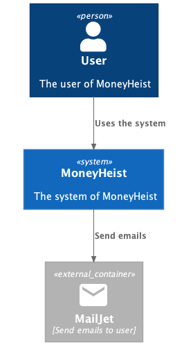
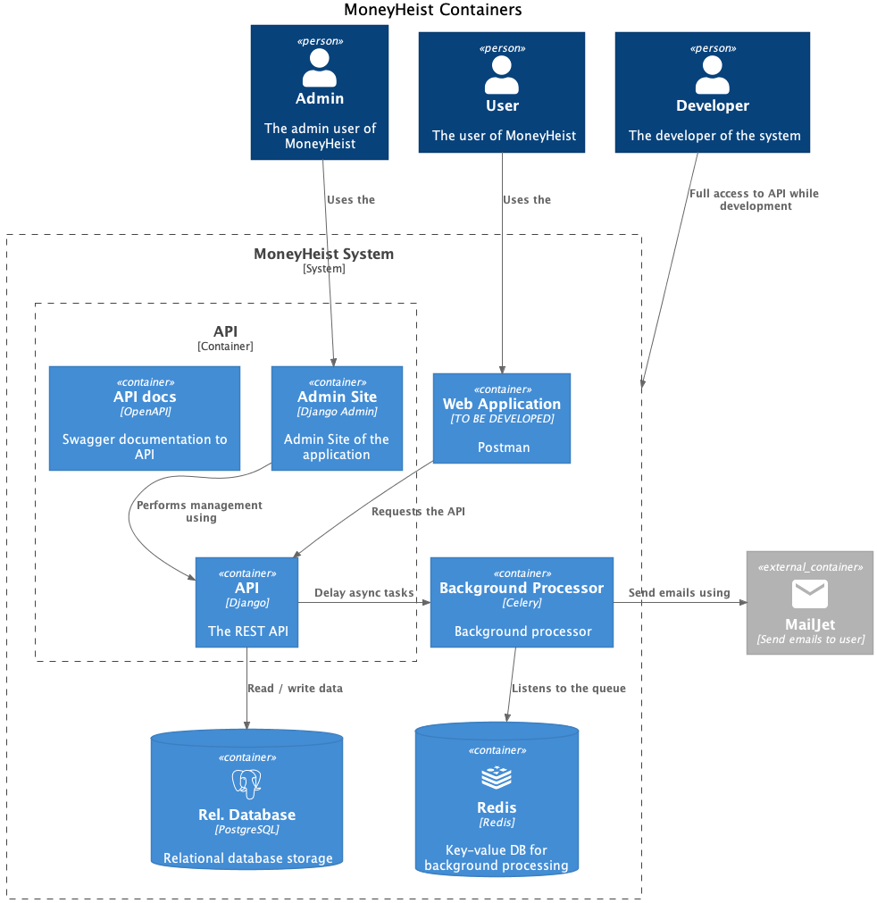
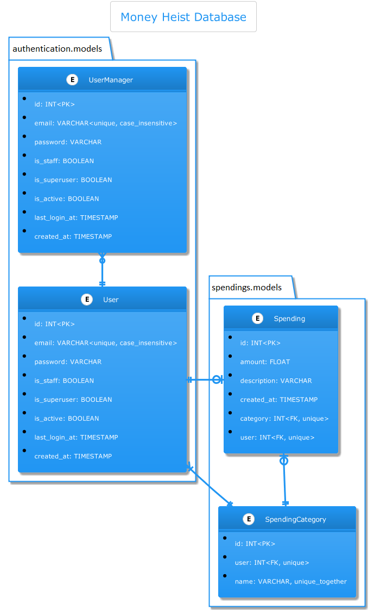
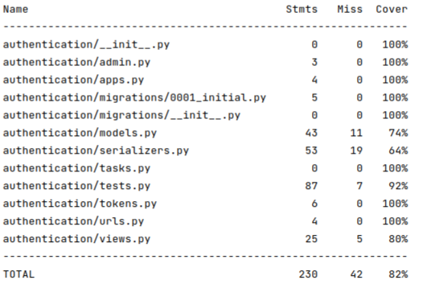
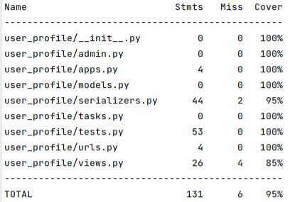
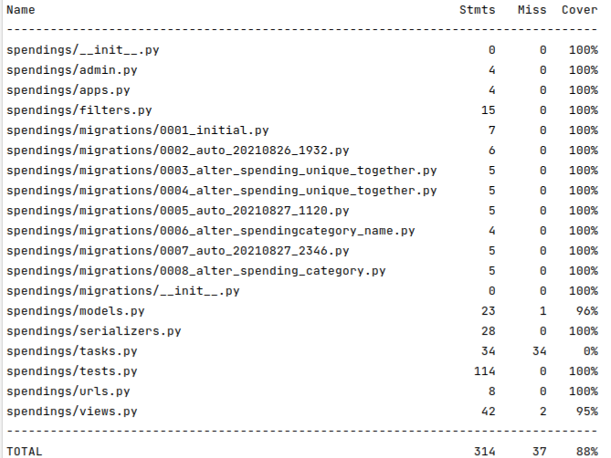

# Money Heist

## Overview

The Money Heist is a spending tracking application. The project is being used to track your incomes spending and current balance. 

## User can

- add spending;
- select category of spending;
- select and change date;
- delete spending;
- filter spendings by many kinds of filtering;
- search spendings;
- export all spendings into .csv file

## Development Libraries

+ Python 3.9
+ Docker
+ Postgres 12.3
+ Rest-Framework
+ Django
+ MailJet API
+ Celery
+ Redis
+ Celery Beat
+ Swagger

## UML Structure

### System level architecture

### Container level architecture

### Database architecture

## Your .env file must contain

Main variables for Django system:
> **SECRET_KEY** - django secret key  

Main variable for your activation url:
> **USER_ACTIVATION_URL** - own created url for activation user (ex. `http://localhost:8000/v1/auth/activate/`)  

Main variables for Postgres Database:
> **POSTGRES_USER** - postgres username  
> **POSTGRES_PASSWORD** - postgres password  
> **POSTGRES_DB** - database name  
> **DB_HOST** - name of host (ex. `localhost`)  
> **DB_PORT** - port for access to database (ex. `5433`)  

Main variable for working Celery:
> **BROKER_URL** - main redis url  

Main variables for MailJet:
> **MAILJET_PUBLIC_KEY** - API key from MailJet account  
> **MAILJET_SECRET_KEY** - SECRET key from MailJet account  
> **MAILJET_USER** - user email from MailJet account  

## Test Coverage

### Test results for authentication

### Test results for managing user data

### Test results for managing spendings

